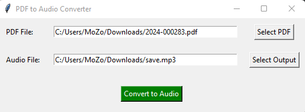
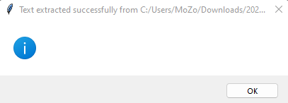

# PDF to Audio Converter

This application allows you to convert text from a PDF file into an audio file (MP3 format) using the Google Text-to-Speech API, gTTS library.

## Features

- If you run the application, a window will appear with the following options:
  - Select a PDF file from your local storage
  - Select the path where the audio file will be saved
  - Select the name of the audio file
  - Click on the "Convert to Audio" button to convert the text to audio
  - A message will appear when the audio file is saved successfully

## Requirements

- Python 3.6 or higher
- PyPDF2
- gTTS
- Tkinter

## Installation

1. Clone the repository
2. Install the required libraries using the following command:
   ```
   pip install -r requirements.txt
   ```
3. Run the application using the following command:
   ```
    python main.py
    ```
4. Select the PDF file, path, and name of the audio file
5. Click on the "Convert to Audio" button
6. The audio file will be saved in the selected path
7. A message will appear when the audio file is saved successfully
8. The audio file can be played using any audio player
9. The audio file can be shared with others

## Screenshots




## Error Handling

- If the PDF file is not selected, an error message will appear
- If the path is not selected, an error message will appear
- If the name of the audio file is not entered, an error message will appear
- If the audio file is not saved successfully, an error message will appear
- If the audio file is saved successfully, a success message will appear

## License

This project is licensed under the MIT License - see the [LICENSE](LICENSE) file for details.