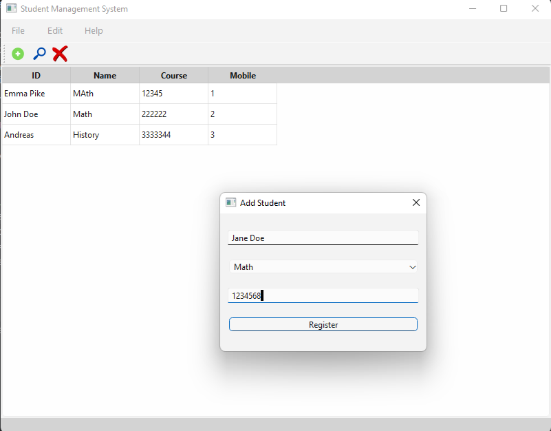
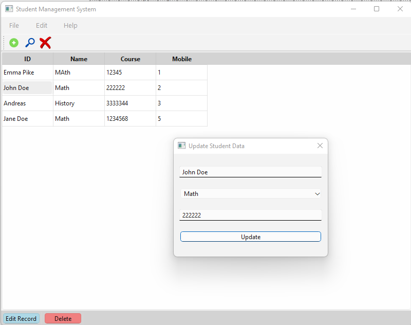
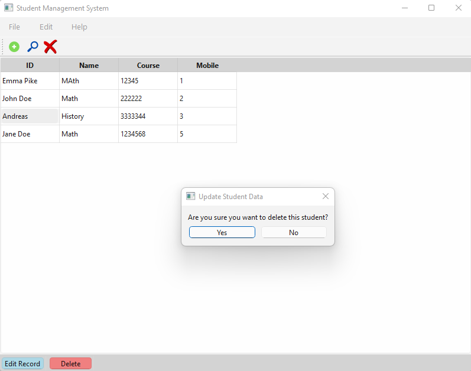
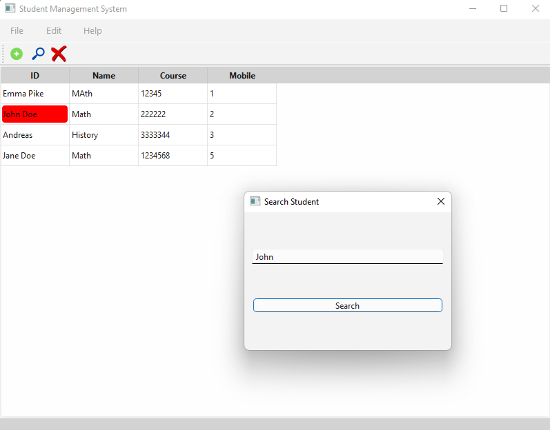

# Student Management System

This is a simple Student Management System built with Python and PyQt6. It allows you to manage student data, including adding, updating and deleting student records from a database.

## Features

- Add student records
- Update existing student data
- Delete student records
- Search for students by name
- View all student list

## Requirements

- Python 3.6 or higher
- PyQt6
- Qt Designer (optional)
- SQLite3 (for database)
- or MySQL (optional)
- The following Python packages (listed in `requirements.txt`):
  - PyQt6
  - PyQt6-sip
  - PyQt6-Qt6
  - PyQt6-tools
  - PyQt6-stubs

## Installation

1. Clone the repository:

```bash
git clone
```

2. Install the required packages:

```bash
pip install -r requirements.txt
```

3. Set up your MySQL database and update the connection derails in 'project/database_connection.py':

```bash
class DatabaseConnection:
        def __init__(self, host="localhost", user="root", password="yourpassword", database="school"):
            # your connection details

```

## Usage

1. Run the following command to start the application:

```bash
python main.py
```

2. Use the GUI to add, update, delete, search and view student records.

## Screenshots






## License

This project is licensed under the MIT License - see the [LICENSE](LICENSE) file for details.
