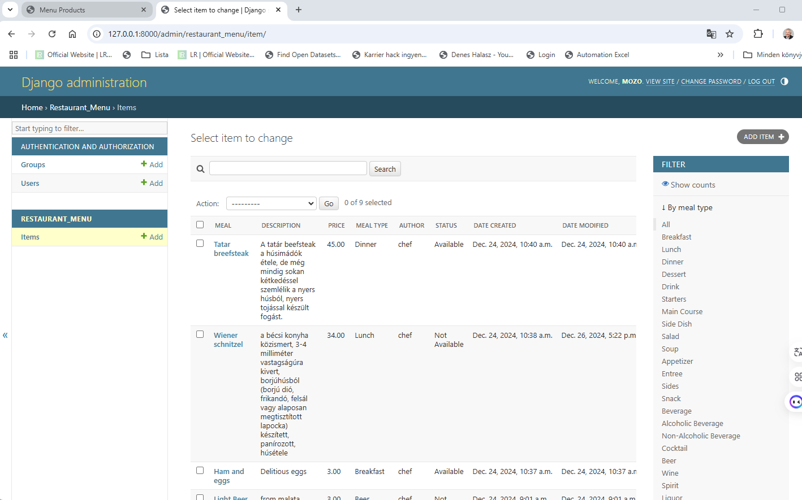
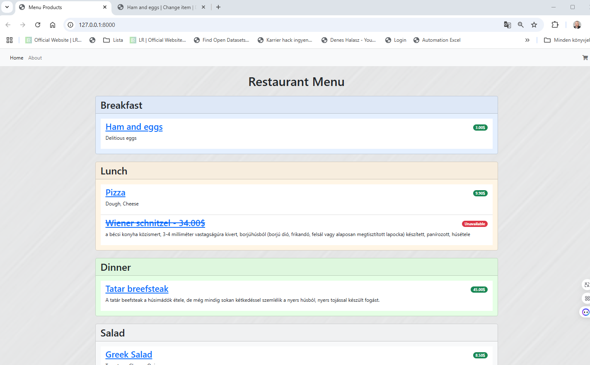
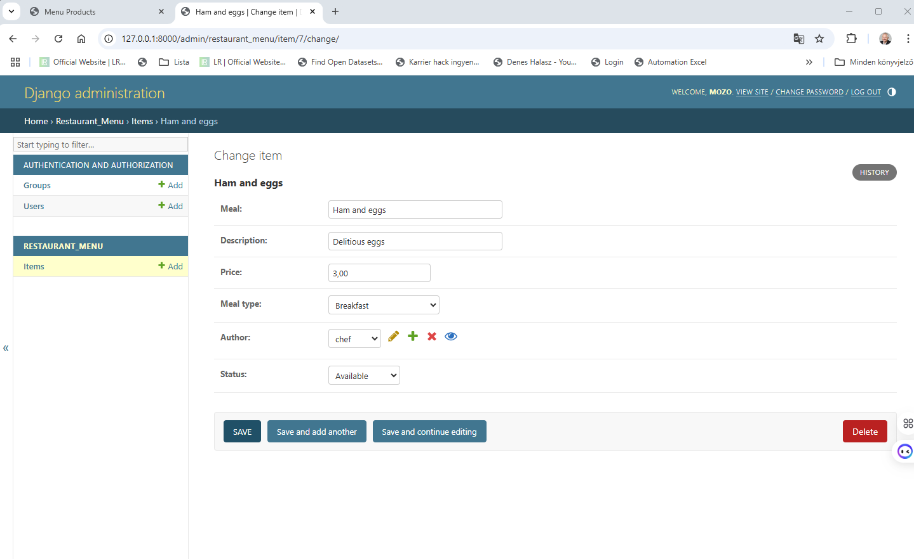
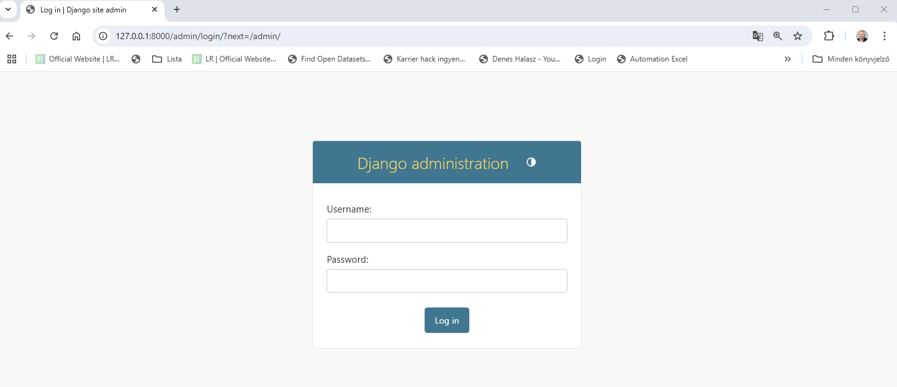
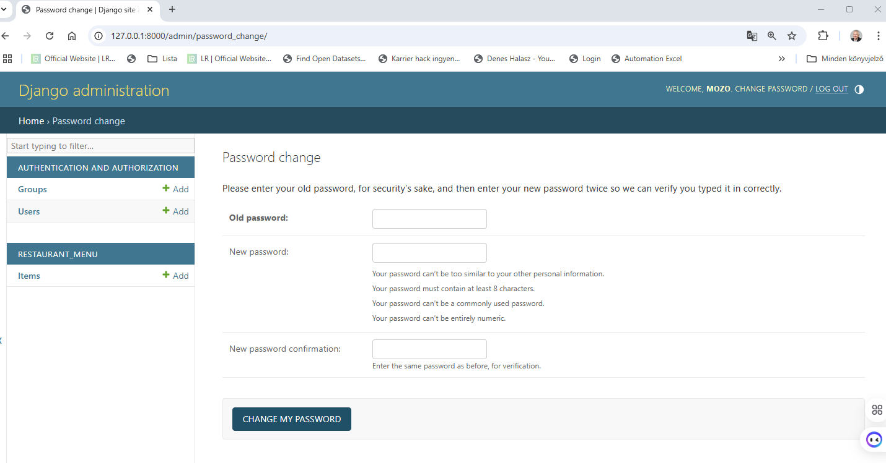

# Restaurant Menu App

This is a Django-based web application for managing and displaying a restaurant's menu. The app allows users to view, add, edit, and delete menu items.

## Features

- Admin interface for managing menu items
- List view of menu items categorized by meal types
- Detail view for individual menu items
- User authentication and authorization
- User registration and login
- User profile page
- User password reset
- Responsive design
- RESTful API for menu items
- API endpoints for menu items, categories, and users

## Technologies

- Python
- Django
- Django REST framework
- SQLite
- HTML
- CSS
- Bootstrap
- JavaScript
- jQuery
- AJAX
- JSON
- Git
- GitHub
- Heroku

## Installation

1. Clone the repository:

```bash
git clone
```

2. Install the required packages:

```bash
pip install -r requirements.txt
```

3. Apply migrations:

```bash
python manage.py migrate
```

4. Create a superuser to access the admin interface:

```bash
python manage.py createsuperuser
```

5. Run the development server:

```bash
python manage.py runserver
```

6. Open the browser and go to `http://127.0.0.1:8000/` to view the app and the admin interface `http://127.0.0.1:8000/admin/`.

## Project Structure

- 'restaurant_menu/admin.py' - Admin interface configuration for menu items, categories, and users
- 'restaurant_menu/models.py' - Database models for menu items, categories, and users
- 'restaurant_menu/urls.py' - URL patterns for the app
- 'restaurant_menu/views.py' - Views for rendering templates and handling requests
- 'restaurant_menu/templates/' - HTML templates for the app
- 'mysite/settings.py' - Django settings for the project

## API Endpoints

- `/api/menu/` - List of menu items
- `/api/menu/<int:pk>/` - Detail of a menu item
- `/api/categories/` - List of categories
- `/api/users/` - List of users
- `/api/users/<int:pk>/` - Detail of a user
- `/api-auth/login/` - Login page for the browsable API
- `/api-auth/logout/` - Logout page for the browsable API
- `/api-auth/password/change/` - Change password page for the browsable API
- `/api-auth/password/reset/` - Reset password page for the browsable API
- `/api-auth/password/reset/confirm/` - Confirm password reset page for the browsable API
- `/api-auth/user/` - User profile page for the browsable API


## Screenshots

[](admin.png)

[](menu.png)

[](admin_change_item.png)

[](login.png)

[](password_reset.png)


## License

This project is licensed under the MIT License - see the [LICENSE](LICENSE) file for details.
``` 
```
