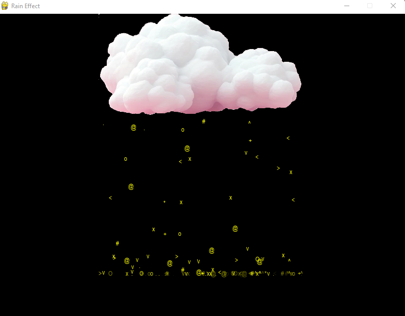

# Rain Effect Simulation

This is a Python program that simulates rain effect using the Pygame library. The program features realistic raindrop movements and sound effects. The raindrops are created using the Pygame library and are animated to fall from the top of the screen to the bottom. The program also features a background image and sound effects to create a more immersive rain effect.

## Features

- Simulates realistic raindrops falling from a cloudy sky
- Realistic raindrop bouncing and fading effects
- Background sound and drop sound effects
- If user clicks on the drop, it will disappear

## Requirements

- Python 3.x
- Pygame library

## Installation

1. Clone the repository:

```bash
git clone

```

2. Install the Pygame library:

```bash
pip install pygame
```

3. Run the program:

```bash
python main.py
```

## Usage

- Run the program using the command above
- Watch the raindrops fall from the sky
- Click on the raindrops to make them disappear
- Enjoy the rain effect!

## Functionality

- The program initializes a Pygame window with a black background.
- A cloud is drawn at the top of the window, and raindrops are crated at random positions below the cloud.
- Raindrops fall with varying speeds and bounce when they hit the ground.
- Raindrops fade out after bouncing a few times.
- Background sound and drop sound effects enhance the simulation experience.
- If the user clicks on a raindrop, it will disappear.

## Screenshots



## License

This project is licensed under the MIT License - see the [LICENSE](LICENSE) file for details.
